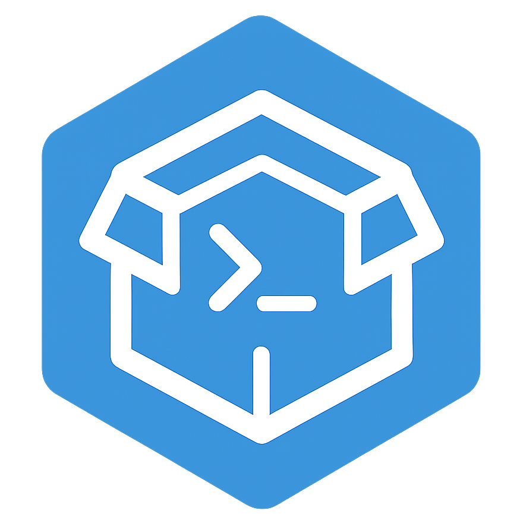

<p align="center">
  
</p>

<h1 align="center"> SandBox Utils</h1> 
<h3 align="center">A Lightweight Rust Foundation for RootFS-Based Runtimes and Sandbox-Oriented Tools</h3>

<p align="center">
  
  <a href="https://github.com/LinuxProativo/sandbox_utils/actions/workflows/rust.yml" style="text-decoration:none;"></a>
  
  <a href="/LICENSE"></a>
</p>

**SandBox Utils** is a modular Rust foundation designed to build lightweight execution environments, rootfs-driven runtimes, and pseudo-container systems.

It was created to serve as a reusable base for projects like **ALPack**, **ArchBox**, **DeBox**, and similar tools that require controlled execution environments without enforcing heavy containerization.


## 🚀 Purpose

SandBox Utils provides reusable building blocks for:

- 🗂 Root filesystem preparation
- ⚙️ Runtime execution context setup
- 🏗 Initialization flows
- 💬 CLI dialog helpers
- 📊 Progress reporting utilities

It does **not** enforce strict sandboxing.
Instead, it gives you composable primitives so each project can define its own isolation level.

## 🧠 Design Philosophy

SandBox Utils follows a few core principles:

- Minimal assumptions about isolation
- Host sharing by default
- No forced namespaces
- Composable modules instead of monolithic logic
- Deterministic and predictable execution flow
- Rust-first, dependency-light approach

This makes it ideal for:

- 📦 AppImage-based systems
- 🐧 Rootfs application runners
- 🧩 OverlayFS environments
- 🛠 Static binary toolchains
- 🔬 Experimental runtime projects

## 🔓 Isolation Strategy

SandBox Utils allows flexible execution models:

- Full host sharing
- Partial isolation
- Custom HOME override
- Overlay-based writable layers
- Optional namespace usage

The consuming project defines the security and isolation model.

## 🧩 Example Usage

Below is a **realistic example** based on the current test suite API:

```rust
use sandbox_utils::*;
use std::path::PathBuf;

fn main() -> Result<(), Box<dyn std::error::Error>> {
    // Initialize sandbox metadata
    sandbox_init("ArchLinux", "ARCHLINUX_ARCH")?;

    // Select backend (proot or bwrap)
    set_sandbox_tool(USE_PROOT)?;

    // Extract rootfs bootstrap (example: tar.gz)
    let archive = PathBuf::from("rootfs.tar.gz");
    let dest = PathBuf::from("/tmp/my_rootfs");
    extract_bootstrap(archive, dest.clone())?;

    // Build runtime configuration
    let mut config = SandBoxConfig {
        rootfs: dest,
        run_cmd = "echo Hello from sandbox".to_string(),
        ..Default::default()
    };

    // Execute command inside rootfs
    SandBox::run(config)?;

    Ok(())
}
```

### 🔄 Switching Backend

```rust
set_sandbox_tool(USE_BWRAP)?; // switch to bubblewrap backend
```

### 📥 Download Helper

```rust
download_file(
    "https://example.com/file.txt",
    PathBuf::from("/tmp/download"),
    "file.txt",
)?;
```

### 💬 Dialog + Diff Utilities

```rust
success_finish_setup("ArchLinux run")?;

let diff = get_config_diff(&old_config, &new_config);
render_table(diff);
```

SandBox Utils is designed so higher-level projects can orchestrate:

- Rootfs bootstrap download
- Archive extraction (gz/xz/zst via features)
- Backend selection (proot/bwrap)
- Command execution as user or root
- Structured CLI feedback

## 🎯 Why Use SandBox Utils?

Instead of rewriting:

- Rootfs validation logic
- Init flows
- CLI confirmation dialogs
- Progress rendering
- Execution context wiring

You reuse SandBox Utils and focus only on what differentiates your project.

## 📜 MIT License

This repository has scripts that were created to be free software.
Therefore, they can be distributed and/or modified within the terms of the ***MIT License***.

> ### See the [LICENSE](LICENSE) file for details.

## 📬 Contact & Support

* 📧 **Email:** [m10ferrari1200@gmail.com](mailto:m10ferrari1200@gmail.com)
* 📧 **Email:** [contatolinuxdicaspro@gmail.com](mailto:contatolinuxdicaspro@gmail.com)

<p align="center">
  <i>SandBox Utils is not a container runtime. It is a foundation layer for
  building your own execution environments.</i>
</p>
